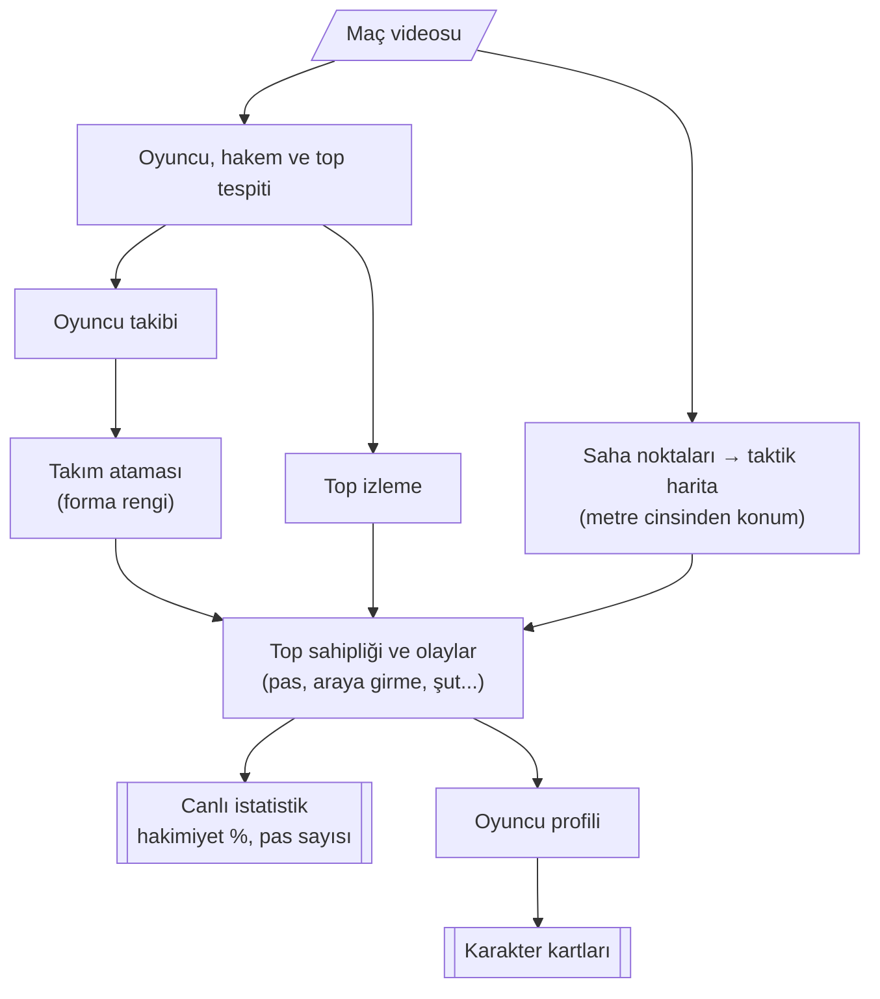

# Sistem mimarisi

Videonun her karesi aşağıdaki adımlardan geçer; analiz bitince oyuncu profilleri ve kartlar üretilir.

```mermaid
flowchart TD
    V[/"Maç videosu"/] --> D["Oyuncu, hakem ve top tespiti"]
    D --> T["Oyuncu takibi"]
    T --> TM["Takım ataması<br/>(forma rengi)"]
    V --> H["Saha noktaları → taktik harita<br/>(metre cinsinden konum)"]
    D --> B["Top izleme"]
    TM --> P["Top sahipliği ve olaylar<br/>(pas, araya girme, şut...)"]
    H --> P
    B --> P
    P --> S[["Canlı istatistik<br/>hakimiyet %, pas sayısı"]]
    P --> PR["Oyuncu profili"]
    PR --> C[["Karakter kartları"]]
```
