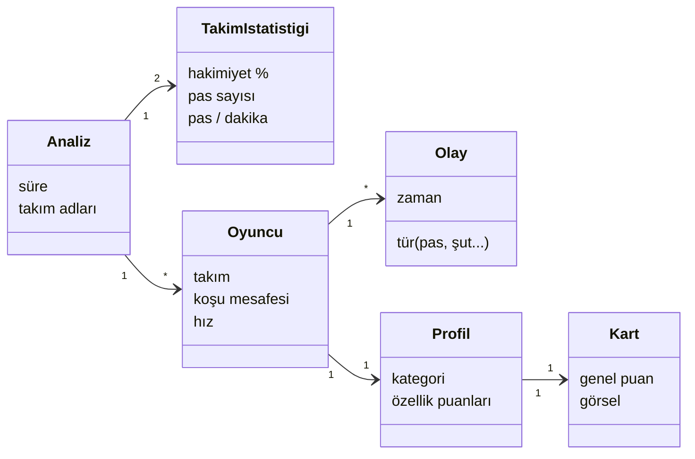

# Analiz çıktıları

Bir analizin ürettiği bilgiler ve aralarındaki ilişki.

```mermaid
classDiagram
    direction LR
    class Analiz {
        süre
        takım adları
    }
    class TakimIstatistigi {
        hakimiyet %
        pas sayısı
        pas / dakika
    }
    class Oyuncu {
        takım
        koşu mesafesi
        hız
    }
    class Olay {
        zaman
        tür (pas, şut...)
    }
    class Profil {
        kategori
        özellik puanları
    }
    class Kart {
        genel puan
        görsel
    }
    Analiz "1" --> "2" TakimIstatistigi
    Analiz "1" --> "*" Oyuncu
    Oyuncu "1" --> "*" Olay
    Oyuncu "1" --> "1" Profil
    Profil "1" --> "1" Kart
```
